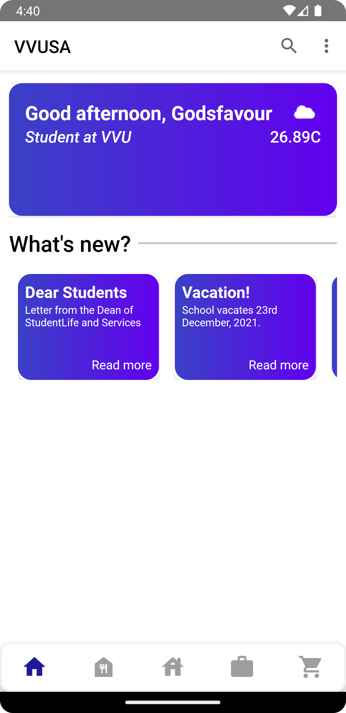
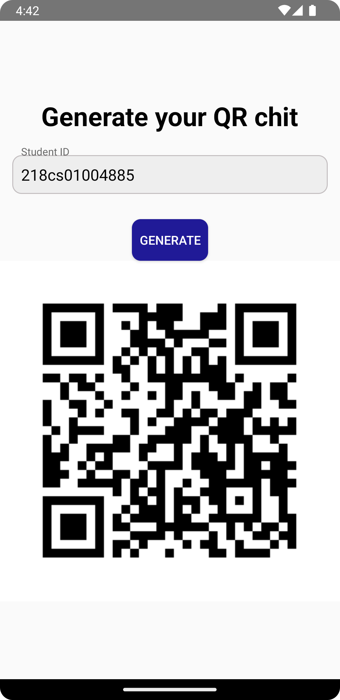
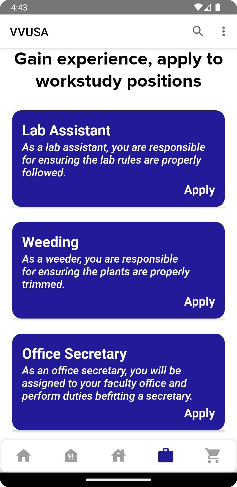
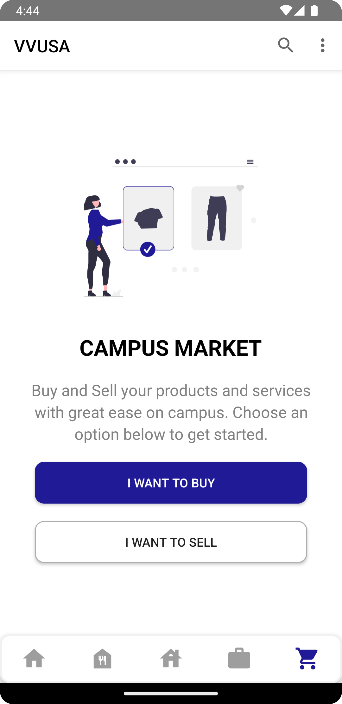
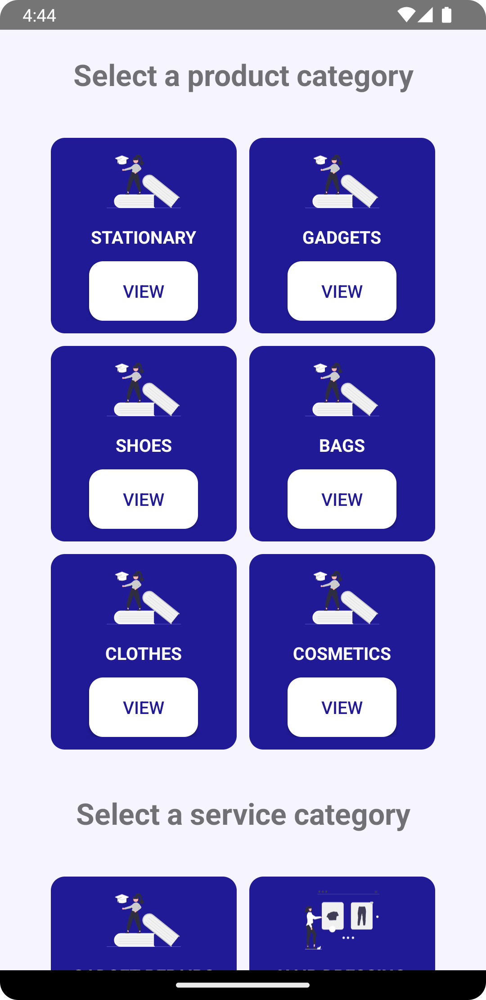
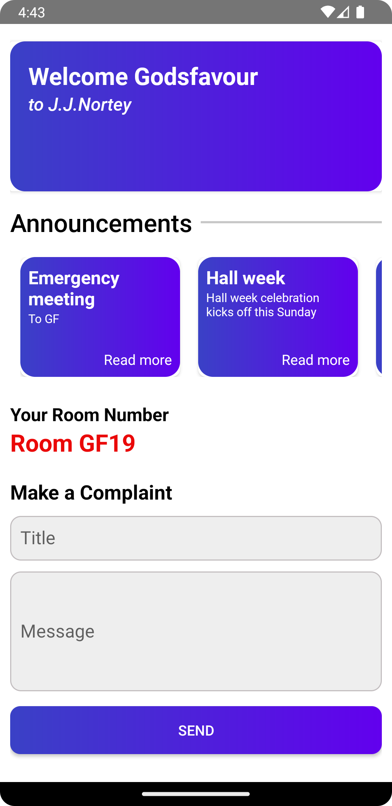

# VVUSA

VVUSA (Valley View University Studentlife App) is a native Android application developed with Java. This app aims to enhance the student experience at Valley View University by unifying various aspects of student life into a single, convenient platform. 

Presented at VVU ICTExpo 2023, you can watch the presentation [here](https://youtu.be/L6lbALwX2c0?si=0Mt4q96zEPnXtS1i).

## About

The Valley View Studentlife mobile application was developed by Kio Godsfavour, a product of VVU. The mobile application was developed as part of his final year project when he discovered existing problems he had encountered during his four-year tenure as a student at the University.

The VVUSA strives to make the studentlife experience at Valley View University exponentially better by tackling 4 very key aspects that students encounter during their stay on campus:

1. The four hostels
2. The Cafeteria
3. The Workstudy department
4. Buying and selling on campus

## Features

The app performs four primary functions:

1. **Room Booking:** Allows students to book rooms in the university hostels from the comfort of their homes.
2. **Digital Cafeteria Chits:** Generates digital chits for students to use at the cafeteria, reducing paper waste.
3. **Workstudy Applications:** Provides an automated system for applying to workstudy positions.
4. **Virtual Marketplace:** Creates a platform for students to buy and sell items on campus.

## Some Screenshots

### Home Screen

### Digital Cafeteria Chits

### Workstudy Applications

### Virtual Marketplace

### Product Categories

### Hostel View

## Acknowledgments

Special thanks to the faculty and students of Valley View University for their support and feedback during the development of this app.
